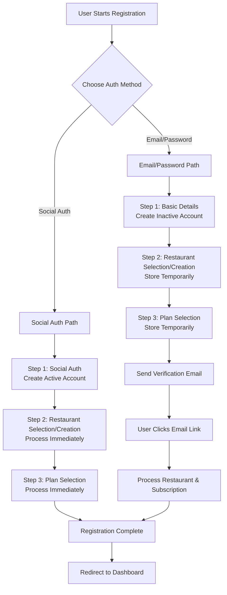

# 3-Step Registration System - Complete Implementation Plan

## Overview

This plan implements a comprehensive registration system with two authentication paths:

1. **Email/Password Registration**: 3-step process with email verification
2. **Social Authentication**: Facebook, Google, X/Twitter - skips email verification

Both paths converge at Steps 2 and 3 (Restaurant Selection & Plan Selection).

---

## Registration Flow Architecture



---

## Path A: Email/Password Registration

### Step 1: Basic Details

**Endpoint**: `POST /api/auth/register-step1/`

**Request**:

```json
{
  "username": "john_doe",
  "email": "john@example.com",
  "password": "SecurePass123!",
  "confirm_password": "SecurePass123!",
  "user_type": "OWNER",
  "first_name": "John",
  "last_name": "Doe",
  "phone_number": "+1-555-123-4567"
}
```

**Response** (201 Created):

```json
{
  "user_id": 123,
  "message": "Step 1 completed. Proceed to Step 2.",
  "next_step": "restaurant_selection",
  "requires_email_verification": true
}
```

**Backend Actions**:

- Create user account with `is_active=False`, `is_email_verified=False`
- Store user_id for frontend to use in subsequent steps
- No email sent at this stage

**Frontend Actions**:

- Store `user_id` in state/session
- Proceed to Step 2 UI

---

### Step 2: Restaurant Selection/Creation

**Endpoint**: `POST /api/auth/register-step2/`

#### Scenario 2A: Select Existing Restaurant

**Request**:

```json
{
  "user_id": 123,
  "action": "select",
  "restaurant_id": 456
}
```

**Response** (200 OK):

```json
{
  "message": "Restaurant selected. Claim request will be created after email verification.",
  "restaurant": {
    "id": 456,
    "name": "Mario's Pizza Palace",
    "address": "123 Main Street, New York, NY",
    "image": "https://...",
    "image_thumbnail": "https://..."
  },
  "next_step": "plan_selection",
  "will_create_claim": true
}
```

**Backend Actions**:

- Validate restaurant exists and is claimable
- Store `temp_restaurant_id` and `temp_is_new_restaurant=False` on user
- Claim will be created after email verification

#### Scenario 2B: Create New Restaurant

**Request**:

```json
{
  "user_id": 123,
  "action": "create",
  "name": "John's Italian Restaurant",
  "street_address": "456 Oak Avenue",
  "city": "Los Angeles",
  "state": "CA",
  "postal_code": "90001",
  "country": "United States",
  "primary_phone": "+1-555-987-6543",
  "primary_email": "info@johnsitalian.com",
  "latitude": "34.0522",
  "longitude": "-118.2437",
  "venue_type_ids": [1, 2],
  "cuisine_style_ids": [3, 4]
}
```

**Response** (201 Created):

```json
{
  "message": "Restaurant created successfully. It will be assigned to you after email verification.",
  "restaurant": {
    "id": 789,
    "name": "John's Italian Restaurant",
    "is_approved": false,
    "owner": 123
  },
  "next_step": "plan_selection",
  "will_create_claim": false
}
```

**Backend Actions**:

- Create restaurant with `owner=user`, `is_approved=False`
- Store `temp_restaurant_id` and `temp_is_new_restaurant=True`
- Restaurant already assigned, no claim needed

**Frontend Actions**:

- Store restaurant selection status
- Proceed to Step 3 UI

---

### Step 3: Plan Selection + Final Submit

**Endpoint**: `POST /api/auth/complete-registration/`

**Request**:

```json
{
  "user_id": 123,
  "plan_id": 2,
  "billing_cycle": "monthly"
}
```

**Response** (200 OK):

```json
{
  "message": "Registration completed! Please check your email to verify your account.",
  "email_verification_sent": true,
  "requires_email_verification": true,
  "user_id": 123
}
```

**Backend Actions**:

- Store `temp_plan_id` and `temp_billing_cycle`
- Generate email verification token
- Send verification email
- Account remains inactive until verification

**Frontend Actions**:

- Show "Check your email" message
- Display email verification instructions
- Option to resend verification email

---

### Email Verification

**Endpoint**: `POST /api/auth/verify-email/`

**Request** (from email link):

```json
{
  "uid": "base64_encoded_user_id",
  "token": "verification_token"
}
```

**Response** (200 OK):

```json
{
  "message": "Email verified successfully! Your account is now active.",
  "user": {
    "id": 123,
    "username": "john_doe",
    "email": "john@example.com",
    "is_email_verified": true,
    "active_subscription": {
      "plan_id": 2,
      "plan_name": "Premium Plan",
      "billing_cycle": "monthly",
      "status": "active"
    }
  },
  "restaurant": {
    "status": "pending",
    "message": "Restaurant claim request submitted. Awaiting admin verification.",
    "restaurant_name": "Mario's Pizza Palace",
    "claim_id": 789,
    "requires_approval": true
  },
  "subscription": {
    "id": 101,
    "plan_id": 2,
    "plan_name": "Premium Plan",
    "billing_cycle": "monthly",
    "status": "active"
  }
}
```

**Backend Actions**:

1. Verify token and activate account (`is_active=True`, `is_email_verified=True`)
2. Process restaurant:

   - **If new restaurant**: Confirm assignment, send welcome email
   - **If existing restaurant**: Create claim request, send claim pending email

3. Assign subscription (selected plan or default free plan)
4. Clear temporary fields (`temp_restaurant_id`, `temp_plan_id`, etc.)

**Frontend Actions**:

- Show success message
- If claim pending: Show "Awaiting admin approval" status
- Redirect to login or dashboard (if claim approved)

---

## Path B: Social Authentication

### Step 1: Social Login

#### Facebook Login

**Endpoint**: `POST /api/auth/social/facebook/`

**Request**:

```json
{
  "access_token": "facebook_access_token",
  "user_type": "OWNER"
}
```

**Response** (200 OK):

```json
{
  "status": "success",
  "access": "jwt_access_token",
  "refresh": "jwt_refresh_token",
  "user": {
    "id": 124,
    "username": "john_doe_fb",
    "email": "john@facebook.com",
    "is_email_verified": true,
    "user_type": "OWNER",
    "social_provider": "facebook"
  },
  "registration_complete": false,
  "next_step": "restaurant_selection",
  "requires_steps_2_and_3": true
}
```

**Backend Actions**:

- Validate Facebook token
- Create/retrieve user account
- Set `is_email_verified=True`, `is_active=True` (social providers verify emails)
- Link social account
- Generate JWT tokens

#### Google Login

**Endpoint**: `POST /api/auth/social/google/`

**Request**:

```json
{
  "id_token": "google_id_token",
  "user_type": "OWNER"
}
```

**Response**: Same structure as Facebook

#### X (Twitter) Login

**Endpoint**: `POST /api/auth/social/twitter/`

**Request**:

```json
{
  "access_token": "twitter_access_token",
  "access_token_secret": "twitter_token_secret",
  "user_type": "OWNER"
}
```

**Response**: Same structure as Facebook

**Frontend Actions**:

- Store JWT tokens
- Check `registration_complete` flag
- If `false`, proceed to Step 2

---

### Step 2: Restaurant Selection (Social Auth)

**Endpoint**: `POST /api/auth/register-step2/`

**Note**: User is authenticated, so no `user_id` needed. Use JWT token in Authorization header.

**Request** (Select Existing):

```json
{
  "action": "select",
  "restaurant_id": 456
}
```

**Response** (200 OK):

```json
{
  "message": "Restaurant claim request created. Awaiting admin verification.",
  "restaurant": {
    "id": 456,
    "name": "Mario's Pizza Palace"
  },
  "claim_status": {
    "status": "pending",
    "claim_id": 789,
    "message": "Restaurant claim request submitted. Awaiting admin verification."
  },
  "next_step": "plan_selection"
}
```

**Backend Actions**:

- Since user is active, create claim request immediately
- Send claim pending email
- No temporary storage needed

**Request** (Create New):

```json
{
  "action": "create",
  "name": "John's Italian Restaurant",
  // ... restaurant data
}
```

**Response** (201 Created):

```json
{
  "message": "Restaurant created and assigned to your account.",
  "restaurant": {
    "id": 789,
    "name": "John's Italian Restaurant"
  },
  "restaurant_status": {
    "status": "assigned",
    "requires_approval": true
  },
  "next_step": "plan_selection"
}
```

**Backend Actions**:

- Create restaurant and assign immediately
- Send welcome email

---

### Step 3: Plan Selection (Social Auth)

**Endpoint**: `POST /api/auth/complete-registration/`

**Request**:

```json
{
  "plan_id": 2,
  "billing_cycle": "monthly"
}
```

**Response** (200 OK):

```json
{
  "message": "Registration completed successfully!",
  "user": {
    // ... user data with active_subscription
  },
  "restaurant": {
    // ... restaurant/claim status
  },
  "subscription": {
    // ... subscription data
  },
  "registration_complete": true
}
```

**Backend Actions**:

- Assign subscription immediately
- Send welcome email (if not sent)
- Registration complete

---

## Additional Endpoints

### Resend Verification Email

**Endpoint**: `POST /api/auth/resend-verification/`

**Request**:

```json
{
  "user_id": 123
}
```

**Response** (200 OK):

```json
{
  "message": "Verification email sent successfully.",
  "email_verification_sent": true
}
```

### Get User Claim Status

**Endpoint**: `GET /api/restaurants/claims/my-claims/`

**Headers**: `Authorization: Bearer <token>`

**Response** (200 OK):

```json
{
  "count": 1,
  "results": [
    {
      "id": 789,
      "restaurant": {
        "id": 456,
        "name": "Mario's Pizza Palace"
      },
      "status": "pending",
      "created_at": "2025-01-13T10:00:00Z"
    }
  ]
}
```

---

## Database Schema Changes

### User Model Updates

Add fields to `users/models.py`:

- `is_email_verified` (BooleanField, default=False)
- `email_verification_token` (CharField, nullable)
- `email_verification_sent_at` (DateTimeField, nullable)
- `email_verified_at` (DateTimeField, nullable)
- `temp_restaurant_id` (IntegerField, nullable)
- `temp_is_new_restaurant` (BooleanField, default=False)
- `temp_plan_id` (IntegerField, nullable)
- `temp_billing_cycle` (CharField, nullable)

### UserSubscription Model

Create new model in `subscriptions/models.py`:

- `user` (ForeignKey to User)
- `subscription_plan` (ForeignKey to SubscriptionPlan)
- `billing_cycle` (CharField)
- `status` (CharField: active/expired/cancelled/pending)
- `start_date` (DateTimeField)
- `end_date` (DateTimeField, nullable)
- `auto_renew` (BooleanField)

---

## Email Templates Required

1. **email_verification.html**: Email verification link
2. **claim_pending_email.html**: Restaurant claim pending notification
3. **claim_approved_email.html**: Restaurant claim approved with dashboard link
4. **welcome_email.html**: Welcome email (existing, may need updates)

---

## Frontend Integration Checklist

### Email/Password Flow

- [ ] Step 1 form: username, email, password, user_type
- [ ] Step 2: Restaurant search/select OR create new restaurant form
- [ ] Step 3: Plan selection UI
- [ ] Email verification page (from email link)
- [ ] Resend verification email functionality
- [ ] Handle claim pending status display

### Social Auth Flow

- [ ] Facebook login button integration
- [ ] Google login button integration
- [ ] X/Twitter login button integration
- [ ] Handle social auth callback
- [ ] Step 2 & 3 UI (same as email/password)
- [ ] Handle immediate processing (no email verification)

### Common

- [ ] Store JWT tokens securely
- [ ] Handle token refresh
- [ ] Display subscription info in user profile
- [ ] Show restaurant claim status
- [ ] Dashboard redirect after completion

---

## Error Handling

### Common Error Responses

**400 Bad Request**:

```json
{
  "error": "Validation error message",
  "field_errors": {
    "email": ["This field is required."]
  }
}
```

**403 Forbidden**:

```json
{
  "error": "Email verification required before login."
}
```

**404 Not Found**:

```json
{
  "error": "Restaurant not found"
}
```

---

## Testing Scenarios

1. Email/password registration with existing restaurant selection
2. Email/password registration with new restaurant creation
3. Social auth (Facebook) with restaurant selection
4. Social auth (Google) with new restaurant creation
5. Email verification flow
6. Claim approval flow
7. Default free plan assignment
8. Error cases: invalid tokens, expired links, duplicate restaurants

---

## Implementation Files

### Backend Files to Create/Modify

1. `users/models.py` - Add email verification fields
2. `users/serializers.py` - Update UserSerializer, add UserSubscriptionSerializer
3. `users/views.py` - Add Step 1, Step 2, Step 3, VerifyEmail, Social Auth views
4. `users/email_service.py` - Add email verification and claim emails
5. `users/urls.py` - Add new routes
6. `subscriptions/models.py` - Add UserSubscription model
7. `restaurants/views.py` - Update claim approval to send email
8. `templates/emails/` - Create email templates

### Migration Files

1. `users/migrations/XXXX_add_email_verification_fields.py`
2. `subscriptions/migrations/XXXX_create_user_subscription.py`

---

## Security Considerations

1. Email verification tokens expire after 24 hours
2. Rate limiting on verification email resends
3. JWT token expiration and refresh handling
4. Social auth token validation
5. CSRF protection for email verification links
6. Secure storage of temporary registration data

---

## Success Criteria

1. Users can register via email/password with 3-step flow
2. Users can register via social auth (Facebook, Google, X)
3. Email verification works correctly
4. Restaurant claims are created and processed
5. Subscriptions are assigned correctly
6. All emails are sent successfully
7. Frontend can display registration status at each step
8. Login response includes subscription information